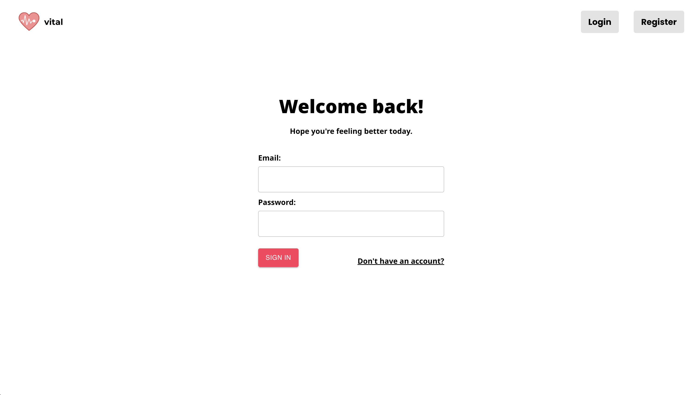
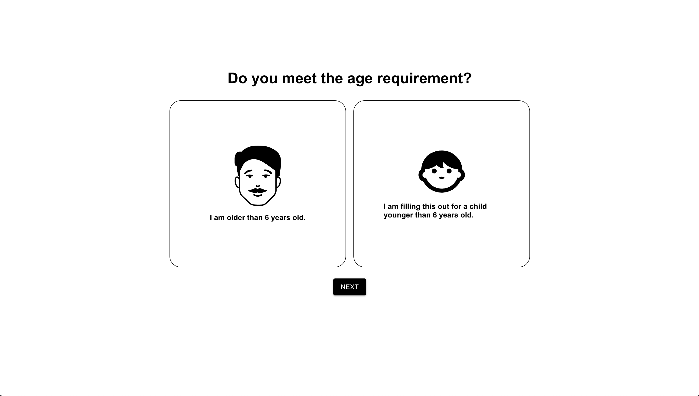
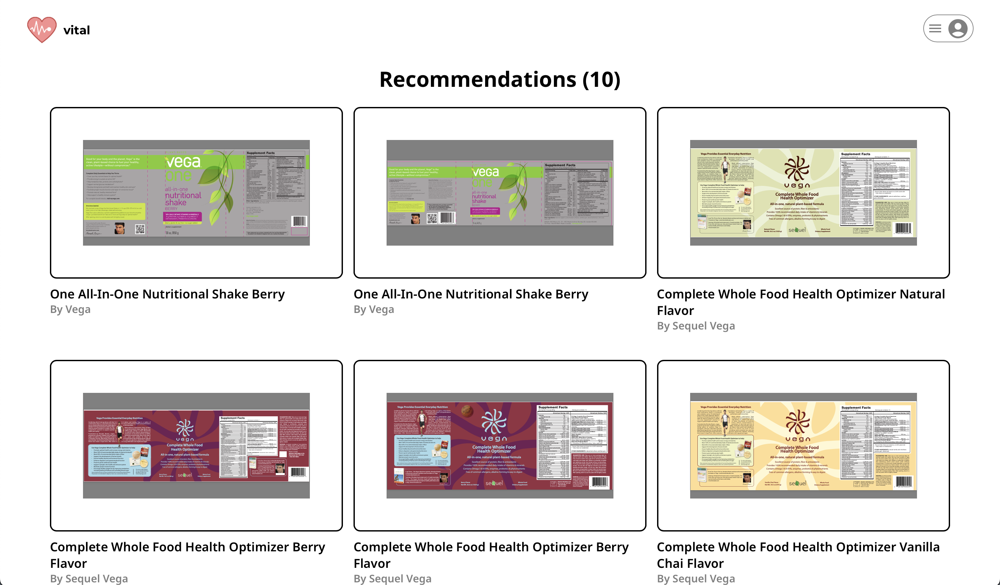

# Welcome to Vital

## Project Overview
“The aim of medicine is to prevent disease and prolong life; the ideal of medicine is to eliminate the need for a physician.” - William J. Mayo, American Physician and Surgeon, and one of the 7 founders of the Mayo Clinic.

**Vital** is an AI-powered recommendation system designed to help users select the best dietary supplements based on their personal health data. It aims to simplify the process of supplement selection, thereby promoting better health outcomes efficiently and cost-effectively.

## Motivation
In today's fast-paced world, maintaining good health can be challenging. Rising healthcare costs and busy lifestyles make it difficult to prioritize proper nutrition and wellness practices. Dietary supplements offer a convenient solution, but choosing the right ones can be confusing and time-consuming. Vital addresses this challenge by leveraging artificial intelligence to provide personalized supplement recommendations tailored to individual health needs.

## What It Does
Vital uses personal information such as age, gender, allergies, and specific health goals to generate a list of recommended dietary supplements. The system employs machine learning models to analyze user inputs and deliver accurate recommendations, saving time and money while enhancing health outcomes.

## Features
- **Personalized Recommendations:** Tailored supplement suggestions based on individual health profiles.
- **Time and Cost Efficiency:** Avoid unnecessary doctor visits with precise supplement recommendations.
- **User-Friendly Interface:** Intuitive design for seamless navigation and ease of use.
- **Secure and Confidential:** Prioritizes user privacy and data security.

## How We Built It
Vital is built using the MERN stack (MongoDB, Express, React, Node.js), Redux for state management, and integrates sentiment analysis models for machine learning capabilities. The system processes user-provided data to generate personalized supplement recommendations, ensuring relevance and accuracy.

## Challenges
One of the main challenges we faced was integrating Python-based machine learning outputs with our web application. Despite initial hurdles, we successfully implemented a Node.js and Express backend to fetch and process data from Python scripts, achieving seamless integration and functionality.

## What We Learned
Our experience with Vital taught us valuable lessons in backend integration and the importance of leveraging familiar technologies for efficient project development. We enhanced our skills in machine learning model deployment and frontend-backend communication, contributing to a robust and user-centric application.

## What's Next for Vital
Moving forward, Vital will continue to evolve by:
- Enhancing machine learning models with richer datasets for improved recommendation accuracy.
- Adding new features to further personalize user experiences and health outcomes.
- Expanding our blog and educational resources to empower users with comprehensive health insights and tips.

---

## Sanpshots

Home Page

Register

Age

History

Recomendations

## Getting Started
To get started with Vital, follow these steps:

1. Clone the repository:

2. Navigate to the project directory:

3. Install dependencies:

4. Start the development server:

5. Open your browser and visit `http://localhost:3000` to use Vital.

---

Thank you for your interest in Vital. We are committed to helping you achieve better health through personalized supplement recommendations.
